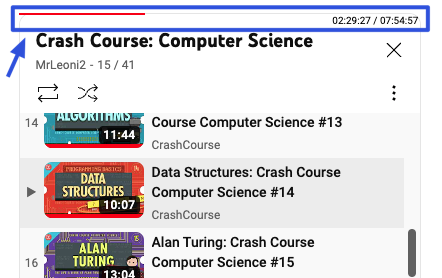
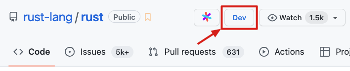

# 冲浪扩展 （Bilibili & YouTube）

## 说明

目前仅自用，未支持 Tampermonkey，我用 [User JavaScript and CSS](https://chromewebstore.google.com/detail/user-javascript-and-css/nbhcbdghjpllgmfilhnhkllmkecfmpld) 这个插件来加载代码。

主要用 JS + JSDoc 来写，不用 TS，不需要编译直接用，以便直接调试。

（但是现在功能写越多，越来越复杂，后续可能考虑还是要 TS+模块化+编译）

主要以 Bilibili 和 YouTube 扩展功能为主

## 代码

### utils

封装了一些工具函数。直接挂载到全局 window 方便使用。（不过 User JavaScript and CSS 有加载顺序的问题的，还是要扩展中调整成 as module。后面有机会重构吧…）

- [net-hook](./src/utils/net-hook.js)：监听 fetch 和 xhr response
- [dom-observer](./src/utils/dom-observer.js)：封装 querySelector + MutationObserver
- [media-control](./src/utils/media-control.js)：常用音视频元素控制功能
- [progress-bar for playlist](./src/utils/progress-bar.js)：播放列表进度条组件

### Bilibili 增强

- [bilibili-enhanced](./src/bilibili-enhanced.js)
- [bilibili-stat-ratio](./src/bilibili-like-ratio.js)
- [bilibili-playlist](./src/bilibili-playlist-pb.js)

override B 站的快捷键（使大部分视频控制键位集中在左手区，以方便单手操作）

- 快捷键
  - `Cmd + Shift + s` 复制当前截图画面
  - `Cmd + Shift + d` 复制视频字幕到剪贴板（以便 ai 解读）
  - `Cmd + Shift + c` 复制干净的视频链接（去除多余小尾巴）
  - `c` 切换字幕显示
  - `b` 软切换弹幕（通过控制图层的 `opacity`，而不是 `display`，这样能保留滚动位置而不是清空）
  - `t` 网页全屏
  - `f` 屏幕全屏
  - `Backspace` 从头播放
  - `Space` 播放暂停
  - `r` 切换单集循环
  - `q`, `ArrowLeft` 倒退 1 秒
  - `e`, `ArrowRight` 前进 1 秒
  - `z` 变速 -0.125
  - `x` 变速 +0.125
  - `v` 切换变速
- 自动化
  - 自动连播行为：如果是列表视频则自动连播，否则单集视频播完暂停
  - 自动暂停其他 B 站标签页的视频，实现唯一当前播放
- 界面
  - 播放列表进度条
  - 点赞率，支持 首页搜索页列表、普通视频页面、bangumi（动画电影）

### YouTube 增强

[code](./src/youtube-enhanced.js)

- 新增的快捷键
  - `Cmd + Shift + s` 复制当前截图画面
  - `Cmd + Shift + d` 复制字幕
  - `[`, `]` 切换列表上下集
  - `Backspace` 从头播放
  - `q` 倒退 1 秒
  - `e` 前进 1 秒
  - `z` 变速 -0.125
  - `x` 变速 +0.125
  - `v` 切换变速
- 自动化
  - 自动暂停其他 YouTube 标签页的视频，实现唯一当前播放
  - 初始自动设置高清晰度
- 界面
  - 播放列表进度条

### 给 Github 添加在线编辑器按钮

[code](./src/github-dev-button.js)

[vscode.dev 和 github.dev 的区别](https://code.visualstudio.com/blogs/2021/10/20/vscode-dev#_github)

（github.dev 也可以通过 GitHub 原生快捷键 `.`）
