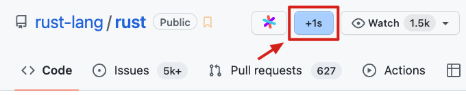

# 自用的一些网站脚本

## 安装

1. 安装 [Tampermonkey](https://www.tampermonkey.net/) 浏览器插件
2. 加载所需的脚本

---

### 恢复网页彩色模式

[加载脚本](https://raw.githubusercontent.com/seognil/my-web-user-scripts/master/src/remove-grayscale.user.js)

移除网站的灰色模式，恢复正常彩色模式（虽然理解是哀悼日，但是这样不方便干活了鸭 >\_< ）

---

### Github1s 按钮

[加载脚本](https://raw.githubusercontent.com/seognil/my-web-user-scripts/master/src/github1s-button.user.js)

点击 github1s 在线编辑器按钮，以便快速打开项目浏览源码

（虽然后来 GitHub 也新增了快捷键 `.` 支持跳转到 github.dev 在线编辑器，功能全但是打开速度比较慢，我更喜欢用 github1s）

---

### link 链接自动跳转

[加载脚本](https://raw.githubusercontent.com/seognil/my-web-user-scripts/master/src/autojump.user.js)

比如从知乎文章点击外部链接 xxx 时，不会直接访问 xxx，而是会访问 https://link.zhihu.com/?target=xxx

加载脚本以支持自动跳转到 xxx（自用，因为各个网站 url 都不太一样，目前只支持掘金、知乎）

---

### YouTube 播放列表进度条

[加载脚本](https://raw.githubusercontent.com/seognil/my-web-user-scripts/master/src/youtube-playlist-timer.user.js)

给 YouTube 播放列表添加一个进度条，该快乐刷网课了 ☺

---

### Bilibili 快捷键

[加载脚本](https://raw.githubusercontent.com/seognil/my-web-user-scripts/master/src/bilibili-enhanced.user.js)

覆写 B 站的快捷键（使大部分视频控制键位集中在左手区，以方便单手操作）

- 快捷键
  - `[`, `]` 切换列表上下集
  - `c` 软切换弹幕（通过控制图层的 `opacity`，而不是 `display`）
  - `t` 网页全屏
  - `f` 屏幕全屏
  - `Backspace` 从头播放
  - `q` 倒退 2 秒
  - `e` 前进 2 秒
  - `Space` 播放暂停
  - `z` 变速 -0.15
  - `x` 变速 +0.15
  - `v` 切换变速
  - `r` 切换单集循环
- 自动化
  - 如果是列表视频则自动连播，否则单集视频播完暂停。
  - 前景视频播放时，暂停其他标签页的视频（防止同时播放多个视频串音）（JS 安全限制所以只能控制 B 站同源页面，不知道有没有更好的做法…）

---
